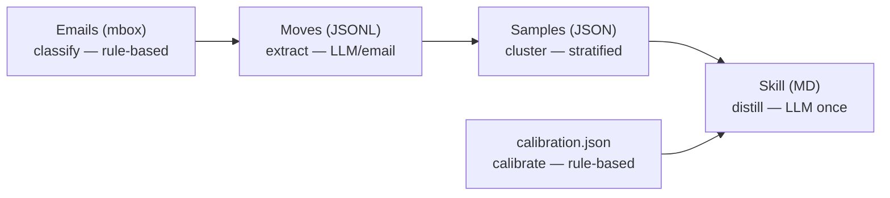
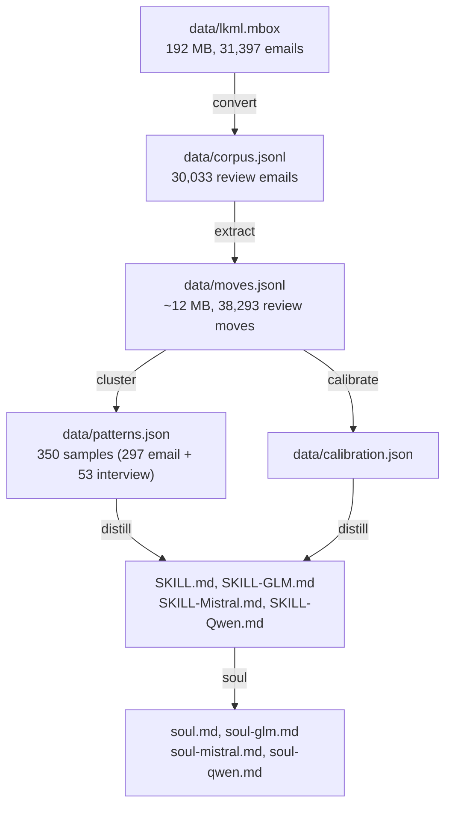

# Pipeline Architecture

This document explains how the torvalds-skill pipeline transforms raw LKML
emails into a language-agnostic code-review skill.

## Overview



Five stages, each with a single responsibility:

| Stage | Input | Output | LLM? | Time |
|---|---|---|---|---|
| 1. Classify | `corpus.jsonl` (30,033 emails) | review/non-review flag | No (regex) | seconds |
| 2. Extract | review emails | `moves.jsonl` (38,293 moves) | Yes (1 call/email) | ~2 hours |
| 3. Cluster | `moves.jsonl` | `patterns.json` (350 samples) | No (stratified) | seconds |
| 3b. Calibrate | `moves.jsonl` | `calibration.json` (severity stats) | No (rule-based) | seconds |
| 4. Distill | `patterns.json` + `calibration.json` | `SKILL.md` (5,000-9,000 words depending on model) | Yes (1 or 15 calls based on profile) | ~2 min |

## Usage

### Pipeline Orchestrator

```bash
# Run the full pipeline (calibrate → distill → verify → soul → review → comparison → stats)
python3 scripts/run_pipeline.py

# Dry-run (show commands without executing)
python3 scripts/run_pipeline.py --dry-run

# Run a single stage
python3 scripts/run_pipeline.py --stage calibrate
python3 scripts/run_pipeline.py --stage distill
python3 scripts/run_pipeline.py --stage review

# Run the full pipeline (legacy: make regen-all)
python3 -m torvalds_skill run --sample 2000 --workers 16

# Run individual stages
python3 -m torvalds_skill classify       # rule-based filter
python3 -m torvalds_skill extract --resume --workers 16   # LLM extraction
python3 -m torvalds_skill cluster        # stratified sampling
python3 scripts/calibrate.py             # severity calibration stats
python3 -m torvalds_skill distill       # generate SKILL.md (loads calibration.json)
python3 -m torvalds_skill soul          # generate soul.md

# Generate a variant skill with a different model
python3 -m torvalds_skill distill --model glm5.2 --out linus-torvalds-skill/SKILL-GLM.md
python3 -m torvalds_skill distill --model mistral-small-4-119b --out linus-torvalds-skill/SKILL-Mistral.md

# Generate a variant soul with a different model
python3 -m torvalds_skill soul --model glm5.2 --out soul/soul-glm.md
python3 -m torvalds_skill soul --model mistral-small-4-119b --out soul/soul-mistral.md

# Verify quality
python3 scripts/verify_skill.py
```

### Resume after a crash

```bash
python3 -m torvalds_skill extract --resume --workers 16
```

Extraction checkpoints every 1,000 emails and skips zero-move message IDs from `data/skip_list.json`.

## Stage 1: Classify (`classify.py`)

**Purpose:** filter announcements from actual reviews.

Rule-based, no LLM. Three filters:

1. **Author filter** — only Linus Torvalds' messages (applied at fetch time).
2. **Git-pull filter** — regex `\[\s*GIT\s+PULL\s*\]` catches all variants.
3. **Zero-move filter** — subjects matching `PATCH`, `RFC`, or generic `Re:`
   are pre-filtered because they overwhelmingly produce zero review moves.

**Output:** each email in `corpus.jsonl` gets a `is_review` boolean.

**Skip list:** `data/skip_list.json` persists message IDs that produced zero
moves in previous runs. On `--resume`, these are skipped entirely, saving
thousands of API calls.

## Stage 2: Extract (`extract.py`)

**Purpose:** extract structured review moves from each email.

**One email = one LLM call.** Batching was tested and rejected:

| Batch size | Move loss | Verdict |
|---|---|---|
| 1 (sequential) | 0% | ✅ baseline |
| 2 | 18% | ❌ rejected |
| 3 | 38.5% | ❌ rejected |
| 5 | 46% | ❌ rejected |

The gpt-oss-120b model suffers attention drift after the second email in a
batch, silently dropping moves. Sequential extraction is mandatory.

**Concurrency:** 16 parallel workers, each making one sequential call. Jittered
retries (0.5-2s) and batched future submission prevent thundering-herd 429s. Uses `concurrent.futures.ThreadPoolExecutor` for parallel extraction.

**Checkpointing:** every 1,000 emails, progress is written to
`data/checkpoint.jsonl`. On crash:

```bash
python -m torvalds_skill extract --resume
```

resumes from the last checkpoint, skipping both done IDs and the skip list.

**Output:** `data/moves.jsonl` — one JSON object per email, containing:

```json
{
  "email_message_id": "<abc@example.com>",
  "moves": [
    {
      "category": "correctness",
      "severity": "reject",
      "trigger": "the patch silently corrupts state on 32-bit systems",
      "principle": "never introduce silent data corruption",
      "quote": "this is broken on 32-bit, period"
    }
  ]
}
```

## Stage 3: Cluster (`cluster.py`)

**Purpose:** reduce 38,293 moves to 350 representative samples for the LLM.

**Why not cluster semantically?** Lexical Jaccard was tried first — it
fragmented badly (7,434 clusters at threshold 0.35, mostly singletons).
Embedding-based cosine similarity was considered but adds an API dependency
for marginal gain. The distill LLM is better at semantic grouping than any
pre-clustering step.

**Stratified sampling** by `category × severity × year`:

- 13 categories × ~25 samples = 350 total (297 email + 53 interview)
- Within each stratum, samples are drawn evenly across years (2002-2026) to
  avoid recency bias
- This guarantees the LLM sees the full range of Torvalds' review style

**Output:** `data/patterns.json` — a list of 350 entries (297 from emails, 53 from interviews):

```json
[
  {
    "category": "correctness",
    "severity": "reject",
    "trigger": "...",
    "principle": "...",
    "quote": "...",
    "source": "email"
  },
  ...
]
```

## Stage 3b: Calibrate (`scripts/calibrate.py`)

**Purpose:** compute data-driven severity statistics from the full moves corpus.

Rule-based, no LLM. Reads `data/moves.jsonl` and produces
`data/calibration.json` containing:

- **P(severity | category)** — probability of each severity level given a
  category. Key findings from 38,293 moves:
  - Security: 59% rejected (highest reject rate)
  - Style: 36% nitpicked, only 13% rejected
  - Error-handling: 58% request-changes
- **Category distribution** — move counts per category
- **Temporal trends** — severity distribution over time (2002-2026)

**Output:** `data/calibration.json`, loaded by `distill.py` and injected into
the LLM prompt as "Severity Calibration" and "Severity Decision Tree" sections.

```bash
python3 scripts/calibrate.py
```

## Interview pipeline

Interview transcripts (TED talks, conference Q&As, magazine interviews) are processed through the same stages as emails:

1. **Fetch** — `interviews` command downloads transcripts from configured URLs in `data/interview_sources.json` (67 sources)
2. **Classify** — `classify-interviews` filters transcripts by relevance
3. **Extract** — `extract-interviews` extracts review moves via LLM (one call per transcript)
4. **Cluster** — `cluster-interviews` merges interview moves with email moves in `patterns.json`
5. **Calibrate** — `calibrate-interviews` merges interview severity stats into `calibration.json`

```bash
python3 -m torvalds_skill interviews              # fetch transcripts
python3 -m torvalds_skill interviews-pipeline      # full pipeline
```

Interview-derived moves (53) are merged with email moves (38,293) in `patterns.json` (350 samples: 297 email + 53 interview). Both skill and soul generation consume the merged patterns.

## Stage 4: Distill (`distill.py`)

**Purpose:** one LLM call turns 350 samples + calibration data into a SKILL.md.

## Caching

All LLM stages (extract, distill, review) use a unified disk-backed cache with deterministic keys.

### Cache key format

Key = `SHA(stage + model + prompt_hash + params_hash)`

Where:
- **stage**: `extract`, `distill`, or `review` (different stages produce different outputs)
- **model**: Model name (different models = different outputs)
- **prompt_hash**: SHA-256 of the full prompt text
- **params_hash**: SHA-256 of serialized parameters (temperature, max_tokens, etc.)

**Rationale:** Every element that affects output is included in the key. Different settings (e.g., `max_tokens=500` vs `max_tokens=1000`) produce different keys, preventing stale outputs.

### Cache configuration

| Variable | Default | Description |
|---|---|---|
| `CACHE_ENABLED` | `1` | Set to `0` to bypass all caching |
| `CACHE_PATH` | `data/unified_cache.jsonl` | Unified cache file location |
| `CACHE_TTL_HOURS` | `168` (7d) | Cache TTL in hours |

### TTL decision

Content-hash keys make time-based expiry redundant for correctness—a key only returns valid results if inputs match exactly. The 7-day default TTL is a practical cleanup window, not a correctness requirement. Override via `CACHE_TTL_HOURS` env var.

### CLI cache commands

```bash
# View cache statistics
python -m torvalds_skill cache stats

# Clear all cache entries
python -m torvalds_skill cache clear

# Compact cache (remove expired + dedupe)
python -m torvalds_skill cache compact
```

### Cache bypass

Use `--no-cache` flag on extract stage or set `CACHE_ENABLED=0`:
```bash
python -m torvalds_skill extract --no-cache --workers 16
CACHE_ENABLED=0 python -m torvalds_skill extract --workers 16
```

### Cache invalidation

Content-hash keys ensure different inputs never return stale outputs. To force re-extraction:
1. Clear the cache: `python -m torvalds_skill cache clear`
2. Or change input parameters (different prompt, model, temperature, etc.)

### File format

Cache entries are stored as JSONL:
```json
{"key": "<sha256>", "response": "<raw LLM output>", "ts": <unix_timestamp>}
```

Corrupt last lines are gracefully skipped on load. Thread-safe with file locking for writes.

**Prompt structure:**

1. **Four qualities of review rules** — every trigger must be one of:
   - `invariant-true`: condition that MUST always be true
   - `invariant-false`: condition that MUST NEVER be true
   - `precedence-rule`: explicit ordering when rules conflict
   - `general-guideline`: concrete, detectable pattern

2. **Precedence chain** — Correctness > Performance > Complexity > Style > API stability

3. **Concrete definitions** — bug, hack/workaround, patch, non-negotiable,
   recoverable error, API contract

4. **Language agnosticism** — forbidden-terms list removes C/kernel APIs
   (BUG_ON, READ_ONCE, copy_to_user, etc.); translation table maps remaining
   kernel-specific phrasing to neutral equivalents. Verbatim quotes are exempt.

5. **Forbidden-terms list** — enforced via post-generation grep. Only verbatim
   quotes may contain language-specific tokens.

6. **Severity calibration** — `calibration.json` is loaded and formatted into
   "Severity Calibration" and "Severity Decision Tree" sections appended to the
   prompt. This gives the LLM corpus-derived statistics so generated reviews
   match Linus' actual severity distribution.

**SSE streaming:** GLM5.2 is a reasoning model that spends minutes on internal
thought. Streaming keeps the connection alive (one token delta = one heartbeat).
Request timeout is 600s for GLM5.2, 120s for others. GLM5.2 also requires
`max_tokens` ≤ 16000.

**Output:** `linus-torvalds-skill/SKILL.md` with:
- YAML frontmatter (name, description, metadata)
- Reviewer Mindset
- Review Triggers (13 themes, each with typed rules)
- Precedence and Priorities (with example)
- Key Definitions
- Voice and Tone
- Severity Calibration
- Severity Decision Tree
- Quick Reference Checklist

## Skill variants

Four variants generated from the same `patterns.json` + `calibration.json`. See [docs/models.md](models.md) for the canonical variant table, word counts, token costs, and regeneration commands.

```bash
# Generate a variant
python -m torvalds_skill distill --model glm5.2 --out linus-torvalds-skill/SKILL-GLM.md
```

## Soul generation (`soul.py`)

A **soul document** defines the AI's persona, values, and voice — not its rules.
The soul generator uses the same `patterns.json` but a different system prompt
focused on identity, decision hierarchy, and communication style.

Four variants generated from the same `patterns.json`. See [docs/models.md](models.md) for the canonical soul variant table and word counts.

```bash
python -m torvalds_skill soul
python -m torvalds_skill soul --model glm5.2 --out soul/soul-glm.md
python -m torvalds_skill soul --model mistral-small-4-119b --out soul/soul-mistral.md
```

Output: `soul/soul.md` — includes Identity, Operating Principles, Decision Patterns, Review Workflow, Communication Style, Emergent Hierarchy, Interlocutor Model, Escalation Rules, Error Gravity, Anti-Soul, Voices, and Insult Vocabulary sections.

## Verification (`verify_skill.py`)

Checks:
- File non-empty
- Word count in range (1,500-10,000)
- Required sections present (Reviewer Mindset, Review Triggers, Precedence and
  Priorities, Key Definitions, Voice and Tone, Severity Calibration,
  Severity Decision Tree, Quick Reference Checklist)
- Real quotes (20+ char quoted strings)
- No placeholder/TODO/stub text
- No forbidden C/kernel terms outside quotes
- Category coverage (10/13)
- Severity levels (4/4)

```bash
python scripts/verify_skill.py linus-torvalds-skill/SKILL.md
```

## Validation (`validate.py`)

Validates data integrity at each pipeline stage:

```bash
python3 -m torvalds_skill validate
```

Checks:
- `moves.jsonl` — schema conformance (required fields, valid categories, valid severities)
- `patterns.json` — sample count, category coverage
- `calibration.json` — category statistics present
- `skip_list.json` — format validity

## Evaluation (`scripts/run_eval.py`)

Measures whether a skill improves a model's bug-finding ability on held-out diffs. This is pure measurement: no training, no fine-tuning.

**Inputs**

- `data/eval_diffs.jsonl` — 45 diffs with ground-truth bugs (schema: `data/eval_diffs.schema.json`, validated by `scripts/validate_eval.py`)
- Model profiles from `src/torvalds_skill/profiles.py`; API credentials from the environment (same contract as the review pipeline)

**Per-record flow**

1. `build_diff_prompt` injects the skill text into the review prompt
2. Model call via `report.llm_review.call_llm` (cache-aware; SIGALRM wall-clock timeout in the main thread, per-read socket timeout in worker threads)
3. `parse_findings_from_review` extracts structured findings; `check_refused` detects refusals
4. Findings are matched to ground-truth bugs; unmatched findings become new-bug candidates
5. `score_finding_with_judge` scores each finding (robust JSON extraction with retry; failures are recorded as `judge_error` and rescored on the next run)
6. The record is appended to the output file

**Resume safety**

Each launch loads existing `(diff_id, model, skill)` keys and skips completed pairs. Failed calls return `None` and are not written, so the next run retries them. Records scored zero by a malformed judge response are re-judged with `--rescore-zeros`.

**Flags**

```bash
# Diagonal (model with its own skill) — writes data/eval_results.jsonl
python3 scripts/run_eval.py

# Cross mode (off-diagonal model×skill pairs) — writes data/eval_results_cross.jsonl
python3 scripts/run_eval.py --cross

# Read-only completion table (no API calls)
python3 scripts/run_eval.py --cross --status

# Limit to specific models; re-judge zeroed records; parallel execution
python3 scripts/run_eval.py --cross --models glm5.2 --rescore-zeros --parallel
```

| Flag | Effect |
|---|---|
| `--cross` | Evaluate off-diagonal model×skill pairs |
| `--out <path>` | Output JSONL path |
| `--status` | Print completion table, make no API calls |
| `--models <m1,m2>` | Restrict to a subset of models |
| `--rescore-zeros` | Re-judge records that previously scored zero (malformed judge JSON) |
| `--force` | Re-evaluate all pairs, ignoring the resume index |
| `--parallel` | Run two (model, skill) pairs concurrently (`ThreadPoolExecutor`, lock-guarded appends) |

**Rendering**

```bash
# 4×4 model×skill matrix (marginals: best model, best skill, novel-bug coverage)
python3 scripts/render_cross.py
```

Outputs: `report/cross_matrix.md` (matrix), plus two diff-based sections in `report/comparison.md` once `data/eval_results.jsonl` exists (generalization and refusal-calibration). Long-running eval logs go to `/tmp/` (for example `/tmp/eval_cross_run3.log`), not `report/`.

## Data flow



## Configuration

### Connection settings

| Env var | Default | Purpose |
|---|---|---|
| `OPENAI_API_KEY` / `REGOLO_API_KEY` / `LLM_API_KEY` | (required) | API key (first set wins) |
| `OPENAI_BASE_URL` / `LLM_HOST` | `https://api.regolo.ai/v1` | LLM API endpoint (first set wins) |
| `LLM_MODEL` | `gpt-oss-120b` | Default model |
| `LLM_MAX_RETRIES` | `3` | Retry count on 429/5xx |

### Caching

| Env var | Default | Purpose |
|---|---|---|
| `CACHE_PATH` | `data/unified_cache.jsonl` | Cache file for LLM responses |
| `CACHE_TTL_HOURS` | `168` | Cache TTL in hours (7 days) |
| `CACHE_ENABLED` | `1` | Set to `0` to bypass unified cache |

CLI flags override env vars:

```bash
python -m torvalds_skill distill --model glm5.2 --out custom.md
python -m torvalds_skill soul --model mistral-small-4-119b --out soul/soul-mistral.md
```

## Resume and recovery

| Stage | Resume | Command |
|---|---|---|
| Extract | Yes | `python -m torvalds_skill extract --resume` |
| Interview extract | Yes | `python -m torvalds_skill extract-interviews --resume` |
| Cluster | No (idempotent) | re-run `python -m torvalds_skill cluster` |
| Calibrate | No (idempotent) | re-run `python3 scripts/calibrate.py` |
| Distill | No (one call) | re-run `python -m torvalds_skill distill` |

Extract resume skips:
1. Message IDs in `data/checkpoint.jsonl` (already processed)
2. Message IDs in `data/skip_list.json` (produced zero moves)
